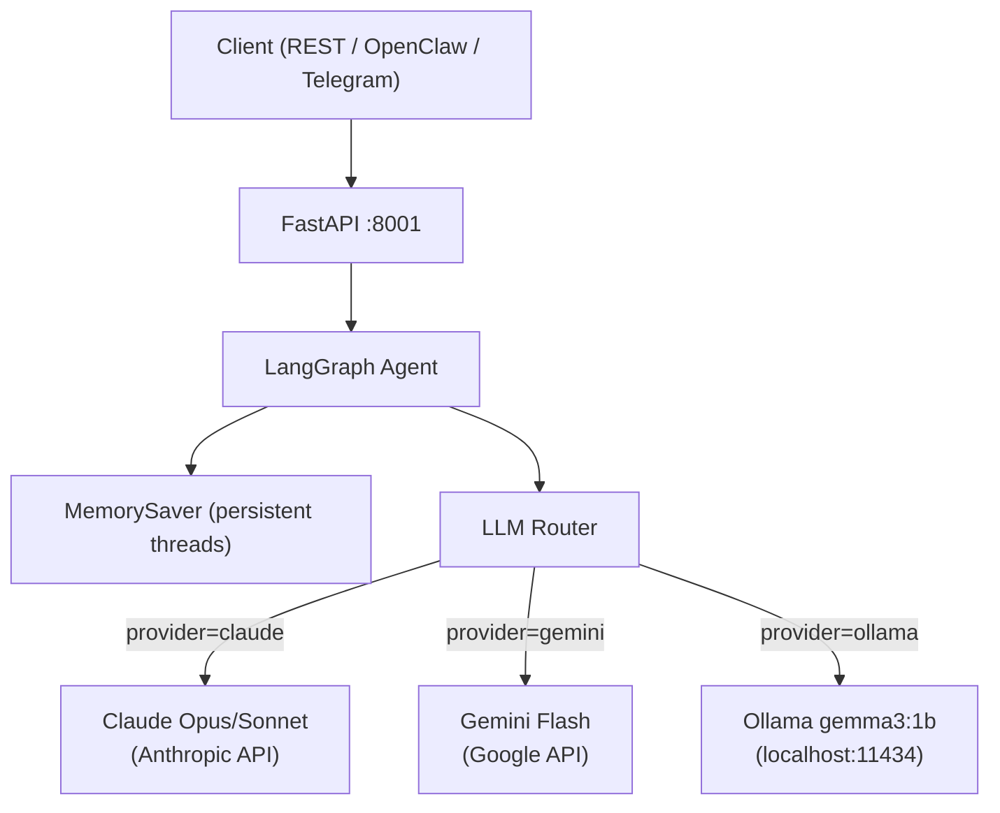

# ai-core-system


> AI Operating System with persistent memory, multi-LLM routing (Claude/Gemini/Ollama), and REST API. Specialized in Finance, Supply Chain and Operations.

---

## Problem Statement

Production AI agents need to handle multiple LLM providers, maintain conversation context across sessions, and expose a reliable API — without being locked to a single cloud provider. This system solves that with a unified LangGraph orchestration layer.

---

## Architecture



---

## Features

- **Multi-LLM routing** — Claude → Gemini → Ollama with single API call
- **Persistent memory** — `thread_id` based sessions via LangGraph `MemorySaver`
- **Context recall** — agent remembers conversation history across requests
- **Offline capable** — Ollama provider works 100% locally, no internet required
- **REST API** — FastAPI with `/chat`, `/health`, `/threads/{id}/history`
- **Finance specialized** — default system prompt tuned for financial analysis

---

## Tech Stack

| Technology | Version | Purpose |
|---|---|---|
| LangGraph | 1.1.10 | Agent orchestration + memory |
| LangChain Anthropic | 1.4.3 | Claude integration |
| LangChain Google GenAI | 4.2.2 | Gemini integration |
| LangChain Community | 0.4.1 | Ollama integration |
| FastAPI | 0.136.1 | REST API server |
| Uvicorn | 0.46.0 | ASGI server |
| Python | 3.13 | Runtime |

---

## Prerequisites

- Python 3.13+
- [uv](https://docs.astral.sh/uv/) — install with: `pip install uv`
- At least one of:
  - Anthropic API key → https://console.anthropic.com/settings/keys
  - Google API key → https://aistudio.google.com/app/apikey
  - [Ollama](https://ollama.com) running locally (free, no key needed)

---

## Installation & Setup

### 1. Clone the repository
```bash
git clone https://github.com/lcarrenoy/ai-core-system.git
cd ai-core-system
```

### 2. Create virtual environment and install dependencies
```powershell
# Windows
uv venv .venv
.venv\Scripts\Activate.ps1
uv sync
```
```bash
# Linux / macOS
uv venv .venv
source .venv/bin/activate
uv sync
```

### 3. Configure environment variables
```powershell
copy .env.example .env
notepad .env
```
```bash
cp .env.example .env
nano .env
```

Fill in your API keys:
```dotenv
ANTHROPIC_API_KEY=sk-ant-...      # https://console.anthropic.com/settings/keys
GOOGLE_API_KEY=AIzaSy...          # https://aistudio.google.com/app/apikey
LANGCHAIN_API_KEY=lsv2_...        # https://smith.langchain.com (optional)
LANGFUSE_SECRET_KEY=sk-lf-...     # https://cloud.langfuse.com (optional)
LANGFUSE_PUBLIC_KEY=pk-lf-...     # https://cloud.langfuse.com (optional)
OLLAMA_BASE_URL=http://localhost:11434
OLLAMA_MODEL=gemma3:1b
DEFAULT_PROVIDER=claude
```

### 4. Start the server
```powershell
uv run uvicorn src.main:app --port 8001
```

Server running at: `http://localhost:8001`
Interactive docs at: `http://localhost:8001/docs`

---

## Quick Start Script (Windows — save as `start_ai_core.ps1`)

```powershell
# start_ai_core.ps1
cd D:\Dev\GitHub\01_IA-Agentes\ai-core-system
.venv\Scripts\Activate.ps1
uv run uvicorn src.main:app --port 8001
```

Run anytime with:
```powershell
Set-ExecutionPolicy -ExecutionPolicy Bypass -Scope Process
.\start_ai_core.ps1
```

---

## Usage

### Basic chat
```powershell
$body = @{
    message   = "Analiza el flujo de caja de esta empresa"
    provider  = "claude"
    thread_id = "session-001"
} | ConvertTo-Json

Invoke-RestMethod -Uri "http://localhost:8001/chat" `
    -Method Post -ContentType "application/json" -Body $body
```

### Test persistent memory (same thread_id = same conversation)
```powershell
# Message 1
$body = @{ message = "Mi nombre es Luis"; provider = "claude"; thread_id = "test-001" } | ConvertTo-Json
Invoke-RestMethod -Uri "http://localhost:8001/chat" -Method Post -ContentType "application/json" -Body $body

# Message 2 — agent remembers
$body = @{ message = "Como me llamo?"; provider = "claude"; thread_id = "test-001" } | ConvertTo-Json
Invoke-RestMethod -Uri "http://localhost:8001/chat" -Method Post -ContentType "application/json" -Body $body
```

### Use local Ollama (no internet, no API key)
```powershell
# Requires Ollama running: ollama serve
# Pull model first: ollama pull gemma3:1b
$body = @{ message = "Hola"; provider = "ollama"; thread_id = "local-001" } | ConvertTo-Json
Invoke-RestMethod -Uri "http://localhost:8001/chat" -Method Post -ContentType "application/json" -Body $body
```

### Get conversation history
```powershell
Invoke-RestMethod -Uri "http://localhost:8001/threads/test-001/history"
```

---

## API Reference

| Method | Endpoint | Description |
|---|---|---|
| GET | `/` | System info + available providers |
| GET | `/health` | Health check |
| POST | `/chat` | Send message to agent |
| GET | `/threads/{thread_id}/history` | Get conversation history |

**POST /chat body:**
```json
{
  "message": "string (required)",
  "provider": "claude | gemini | ollama",
  "thread_id": "string (optional — auto-generated if omitted)",
  "system_prompt": "string (optional — overrides default finance prompt)"
}
```

---

## Project Structure

```
ai-core-system/
├── src/
│   ├── __init__.py
│   ├── agent.py          # LangGraph graph + LLM router + MemorySaver
│   └── main.py           # FastAPI app + endpoints
├── .env.example          # Environment variables template
├── .gitignore
├── pyproject.toml        # Dependencies (uv)
├── uv.lock               # Locked dependencies
└── README.md
```

---

## Key Results

| Metric | Value |
|---|---|
| Providers supported | 3 (Claude, Gemini, Ollama) |
| Memory persistence | ✅ Per thread_id |
| Context recall | ✅ Verified |
| Offline capability | ✅ via Ollama |
| GPU required | ❌ CPU-only |
| Min RAM (with Ollama) | 12 GB |

---

## Tech Decisions & Trade-offs

| Decision | Choice | Reason |
|---|---|---|
| Memory backend | MemorySaver (in-memory) | Simple start; swap to PostgreSQL for prod |
| Default provider | Claude Sonnet | Best quality/cost for finance tasks |
| Ollama model | gemma3:1b | Lightweight, runs on CPU 12GB RAM |
| API framework | FastAPI | Async, auto-docs, production ready |
| Orchestration | LangGraph | Native memory + graph state management |

---

## Roadmap

- [ ] ChromaDB for persistent RAG memory
- [ ] MCP Protocol tool-calling integration
- [ ] LangFuse observability (traces + evals)
- [ ] PostgreSQL checkpointer for production memory
- [ ] Gemini fallback when Claude quota exceeded
- [ ] OpenClaw WebSocket channel integration
- [ ] Docker + docker-compose deployment

---

*Part of [Luis Carreño's portfolio](https://github.com/lcarrenoy) · AI Engineer · Financial Engineering · Lima, Perú · 2026*