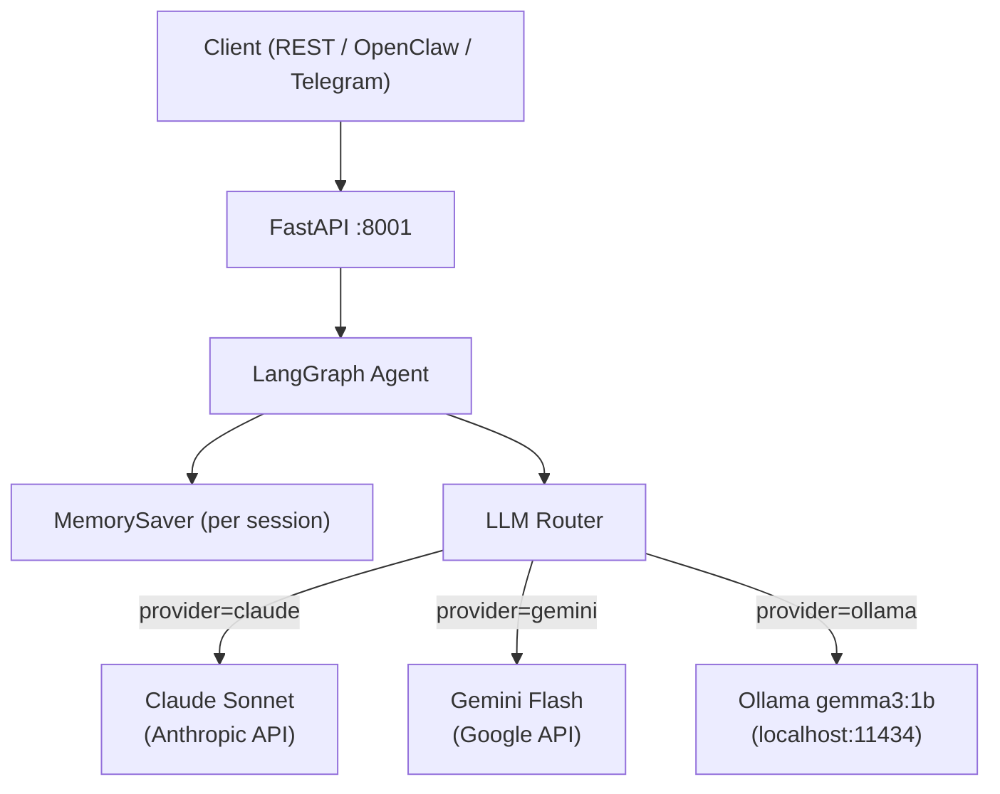

# ai-core-system


> AI Operating System with persistent memory, multi-LLM routing (Claude/Gemini/Ollama), and REST API. Specialized in Finance, Supply Chain and Operations.

---

## Problem Statement

Production AI agents need to handle multiple LLM providers, maintain conversation context across sessions, and expose a reliable API — without being locked to a single cloud provider. This system solves that with a unified LangGraph orchestration layer.

---

## Architecture



---

## Features

- **Multi-LLM routing** — Claude, Gemini or Ollama with a single API call
- **Persistent memory** — `thread_id` sessions via LangGraph `MemorySaver`
- **Offline capable** — Ollama provider works 100% locally, no internet required
- **REST API** — FastAPI with `/chat`, `/health`, `/threads/{id}/history`
- **Finance specialized** — system prompt tuned for Finance, Supply Chain & Operations
- **Auto-docs** — Swagger UI available at `/docs`

---

## Tech Stack

| Technology | Version | Purpose |
|---|---|---|
| LangGraph | 1.1.10 | Agent orchestration + memory |
| LangChain Anthropic | 1.4.3 | Claude integration |
| LangChain Google GenAI | 4.2.2 | Gemini integration |
| LangChain Community | 0.4.1 | Ollama integration |
| FastAPI | 0.136.1 | REST API server |
| Uvicorn | 0.46.0 | ASGI server |
| Python | 3.13 | Runtime |
| uv | latest | Package manager |

---

## Prerequisites

- Python 3.13+ with [uv](https://docs.astral.sh/uv/) → `pip install uv`
- At least one LLM provider:
  - **Claude** → get key at https://console.anthropic.com/settings/keys
  - **Gemini** → get key at https://aistudio.google.com/app/apikey
  - **Ollama** → install at https://ollama.com (free, no key needed)
    - Pull model: `ollama pull gemma3:1b`
- Optional observability:
  - **LangSmith** → https://smith.langchain.com
  - **LangFuse** → https://cloud.langfuse.com

---

## Installation

```bash
# 1. Clone
git clone https://github.com/lcarrenoy/ai-core-system.git
cd ai-core-system
```

```powershell
# 2. Create venv and install (Windows)
uv venv .venv
.venv\Scripts\Activate.ps1
uv sync
```

```bash
# 2. Create venv and install (Linux/macOS)
uv venv .venv
source .venv/bin/activate
uv sync
```

```powershell
# 3. Configure environment
copy .env.example .env
notepad .env        # Windows
# nano .env         # Linux/macOS
```

Fill in your `.env`:
```dotenv
ANTHROPIC_API_KEY=sk-ant-...     # https://console.anthropic.com/settings/keys
GOOGLE_API_KEY=AIzaSy...         # https://aistudio.google.com/app/apikey
LANGCHAIN_API_KEY=lsv2_...       # https://smith.langchain.com (optional)
LANGFUSE_SECRET_KEY=sk-lf-...    # https://cloud.langfuse.com (optional)
LANGFUSE_PUBLIC_KEY=pk-lf-...    # https://cloud.langfuse.com (optional)
OLLAMA_BASE_URL=http://localhost:11434
OLLAMA_MODEL=gemma3:1b
DEFAULT_PROVIDER=claude
```

---

## ⚡ Quick Start (Windows)

### Step 1 — Save start script

Save this as `start_ai_core.ps1` in your scripts folder:

```powershell
# start_ai_core.ps1
Write-Host "Starting AI Core System..." -ForegroundColor Cyan
cd D:\Dev\GitHub\01_IA-Agentes\ai-core-system
.venv\Scripts\Activate.ps1
uv run uvicorn src.main:app --port 8001
```

### Step 2 — Save test script

Save this as `test_ai_core.ps1` in your scripts folder:

```powershell
# test_ai_core.ps1
Write-Host "Testing AI Core System at :8001..." -ForegroundColor Cyan

# 1. Health check
Write-Host "`n[1] Health:" -ForegroundColor Yellow
$h = Invoke-RestMethod -Uri "http://localhost:8001/health"
Write-Host "   Status: $($h.status)" -ForegroundColor Green

# 2. Chat with Claude
Write-Host "`n[2] Claude:" -ForegroundColor Yellow
$body = @{ message = "Hi, who are you?"; provider = "claude"; thread_id = "test-001" } | ConvertTo-Json
$r = Invoke-RestMethod -Uri "http://localhost:8001/chat" -Method Post -ContentType "application/json" -Body $body
Write-Host "   $($r.response)" -ForegroundColor White

# 3. Memory test (same thread_id)
Write-Host "`n[3] Memory test:" -ForegroundColor Yellow
$body = @{ message = "What did I ask you before?"; provider = "claude"; thread_id = "test-001" } | ConvertTo-Json
$r = Invoke-RestMethod -Uri "http://localhost:8001/chat" -Method Post -ContentType "application/json" -Body $body
Write-Host "   $($r.response)" -ForegroundColor White

# 4. Ollama local (no internet needed)
Write-Host "`n[4] Ollama (local, offline):" -ForegroundColor Yellow
$body = @{ message = "Hello"; provider = "ollama"; thread_id = "ollama-001" } | ConvertTo-Json
$r = Invoke-RestMethod -Uri "http://localhost:8001/chat" -Method Post -ContentType "application/json" -Body $body
Write-Host "   $($r.response)" -ForegroundColor White

Write-Host "`nAll OK!" -ForegroundColor Green
```

### Step 3 — Run every time

**Terminal 1** — start server:
```powershell
cd D:\Dev\PS1
Set-ExecutionPolicy -ExecutionPolicy Bypass -Scope Process
.\start_ai_core.ps1
```

Wait for: `Application startup complete.`

**Terminal 2** — test all providers:
```powershell
cd D:\Dev\PS1
Set-ExecutionPolicy -ExecutionPolicy Bypass -Scope Process
.\test_ai_core.ps1
```

**Expected output:**
```
Testing AI Core System at :8001...

[1] Health:
   Status: ok

[2] Claude:
   Hola! Soy un asistente de IA especializado en Finanzas...

[3] Memory test:
   Me preguntaste quien soy...

[4] Ollama (local, offline):
   Hello! How can I help you today...

All OK!
```

> ⚠️ Memory resets on server restart (in-memory). For persistent memory across restarts, PostgreSQL checkpointer is planned in the roadmap.

---

## API Reference

| Method | Endpoint | Description |
|---|---|---|
| GET | `/` | System info + available providers |
| GET | `/health` | Health check |
| GET | `/docs` | Interactive Swagger UI |
| POST | `/chat` | Send message to agent |
| GET | `/threads/{thread_id}/history` | Get conversation history |

**POST /chat — request:**
```json
{
  "message": "Analyze this cash flow statement",
  "provider": "claude",
  "thread_id": "session-001",
  "system_prompt": "You are a senior financial analyst"
}
```

**POST /chat — response:**
```json
{
  "response": "Based on the cash flow...",
  "thread_id": "session-001",
  "provider": "claude"
}
```

---

## Project Structure

```
ai-core-system/
├── src/
│   ├── __init__.py
│   ├── agent.py      # LangGraph graph + LLM router + MemorySaver
│   └── main.py       # FastAPI app + all endpoints
├── .env.example      # Environment variables template
├── .gitignore
├── pyproject.toml    # Dependencies managed with uv
├── uv.lock
└── README.md
```

---

## Key Results

| Metric | Value |
|---|---|
| Providers | 3 (Claude, Gemini, Ollama) |
| Memory | ✅ Per thread_id (in-memory) |
| Offline mode | ✅ via Ollama gemma3:1b |
| GPU required | ❌ CPU-only |
| Min RAM | 12 GB (with Ollama) |
| Response time | <2s Claude · <1s Ollama |

---

## Tech Decisions & Trade-offs

| Decision | Choice | Reason |
|---|---|---|
| Memory backend | MemorySaver (RAM) | Simple start; PostgreSQL planned for prod |
| Default LLM | Claude Sonnet | Best quality/cost for finance tasks |
| Local model | gemma3:1b via Ollama | Lightweight, no GPU, 815MB |
| API framework | FastAPI | Async, auto-docs, production ready |
| Orchestration | LangGraph | Native memory + graph state management |

---

## Roadmap

- [ ] ChromaDB for persistent RAG memory
- [ ] MCP Protocol tool-calling integration
- [ ] LangFuse observability (traces + evals)
- [ ] PostgreSQL checkpointer (memory survives restarts)
- [ ] Gemini fallback when Claude quota exceeded
- [ ] Docker + docker-compose deployment
- [ ] OpenClaw WebSocket channel integration

---

*Part of [Luis Carreño's portfolio](https://github.com/lcarrenoy) · AI Engineer · Financial Engineering · Lima, Perú · 2026*