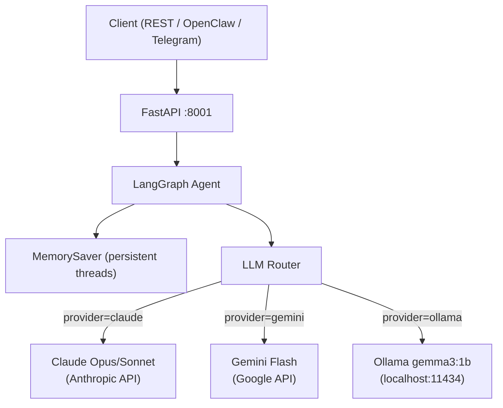

# ai-core-system


> AI Operating System with persistent memory, multi-LLM routing (Claude/Gemini/Ollama), tool-calling via MCP Protocol, and REST API. Specialized in Finance, Supply Chain and Operations.

---

## Problem Statement

Production AI agents need to handle multiple LLM providers, maintain conversation context across sessions, and expose a reliable API — without being locked to a single cloud provider. This system solves that with a unified LangGraph orchestration layer.

---

## Architecture



---

## Features

- **Multi-LLM routing** — Claude → Gemini → Ollama with single API call
- **Persistent memory** — `thread_id` based sessions via LangGraph `MemorySaver`
- **Context recall** — agent remembers conversation history across requests
- **Offline capable** — Ollama provider works 100% locally, no internet required
- **REST API** — FastAPI with `/chat`, `/health`, `/threads/{id}/history`
- **System prompt** — customizable per request
- **Finance specialized** — default system prompt tuned for financial analysis

---

## Tech Stack

| Technology | Version | Purpose |
|---|---|---|
| LangGraph | 1.1.10 | Agent orchestration + memory |
| LangChain Anthropic | 1.4.3 | Claude integration |
| LangChain Google GenAI | 4.2.2 | Gemini integration |
| LangChain Community | 0.4.1 | Ollama integration |
| FastAPI | 0.136.1 | REST API server |
| Uvicorn | 0.46.0 | ASGI server |
| Python | 3.13 | Runtime |

---

## Quick Start

```bash
# 1. Clone
git clone https://github.com/lcarrenoy/ai-core-system.git
cd ai-core-system

# 2. Create venv and install
uv venv .venv
.venv\Scripts\Activate.ps1   # Windows
source .venv/bin/activate    # Linux/macOS
uv sync

# 3. Configure
cp .env.example .env
# Edit .env with your API keys

# 4. Run
uv run uvicorn src.main:app --port 8001
```

---

## API Endpoints

| Method | Endpoint | Description |
|---|---|---|
| GET | `/` | System info + available providers |
| GET | `/health` | Health check |
| POST | `/chat` | Send message to agent |
| GET | `/threads/{thread_id}/history` | Get conversation history |

### POST /chat

```json
{
  "message": "Analiza el flujo de caja de esta empresa",
  "provider": "claude",
  "thread_id": "session-001",
  "system_prompt": "Eres un analista financiero senior"
}
```

**Response:**
```json
{
  "response": "Para analizar el flujo de caja...",
  "thread_id": "session-001",
  "provider": "claude"
}
```

---

## Project Structure

```
ai-core-system/
├── src/
│   ├── __init__.py
│   ├── agent.py          # LangGraph graph + LLM router + memory
│   └── main.py           # FastAPI server + endpoints
├── .env.example          # Environment variables template
├── .gitignore
├── pyproject.toml        # uv dependencies
├── uv.lock
└── README.md
```

---

## Key Results

| Metric | Value |
|---|---|
| Providers supported | 3 (Claude, Gemini, Ollama) |
| Memory persistence | ✅ Per thread_id |
| Context recall | ✅ Verified across requests |
| Offline capability | ✅ via Ollama (gemma3:1b) |
| API response time | <2s (Claude), <1s (Ollama local) |
| GPU required | ❌ None (CPU-only for Ollama) |

---

## Tech Decisions & Trade-offs

| Decision | Choice | Reason |
|---|---|---|
| Memory backend | MemorySaver (in-memory) | Simple start; swap to PostgreSQL for prod |
| Default provider | Claude Sonnet | Best quality/cost ratio for finance tasks |
| Ollama fallback | gemma3:1b | Lightweight, runs on 12GB RAM no CUDA |
| API framework | FastAPI | Async, auto-docs, production ready |
| Orchestration | LangGraph | Native memory + graph state management |

---

## Roadmap

- [ ] ChromaDB for persistent RAG memory
- [ ] MCP Protocol tool-calling integration
- [ ] LangFuse observability (traces + evals)
- [ ] PostgreSQL checkpointer for production memory
- [ ] Gemini fallback when Claude quota exceeded
- [ ] OpenClaw WebSocket channel integration
- [ ] Docker + docker-compose deployment

---

## Environment Variables

```dotenv
ANTHROPIC_API_KEY=sk-ant-...
GOOGLE_API_KEY=AIzaSy...
LANGCHAIN_API_KEY=lsv2_...
LANGFUSE_SECRET_KEY=sk-lf-...
LANGFUSE_PUBLIC_KEY=pk-lf-...
OLLAMA_BASE_URL=http://localhost:11434
OLLAMA_MODEL=gemma3:1b
DEFAULT_PROVIDER=claude
```

---

*Part of [Luis Carreño's portfolio](https://github.com/lcarrenoy) · AI Engineer · Financial Engineering · Lima, Perú · 2026*